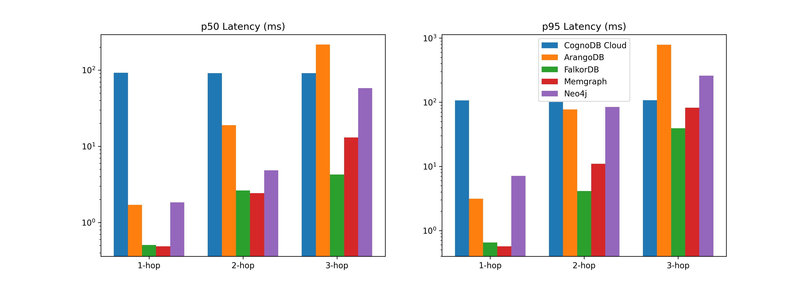
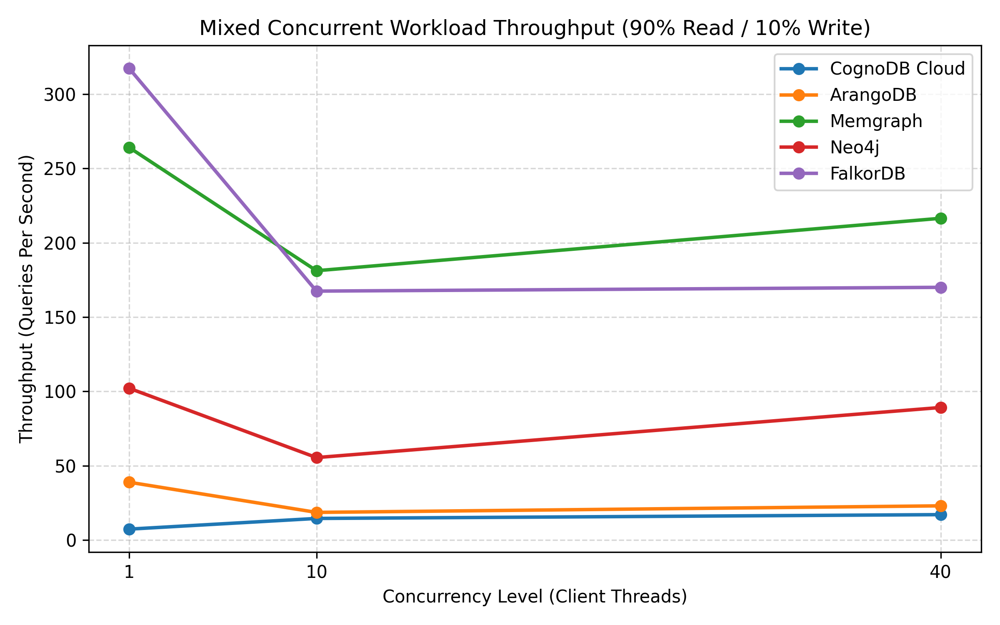

# Graph Database Cloud Benchmarking Suite: CognoDB Cloud vs. Managed Graph Platforms

A reproducible, automated benchmark suite comparing **CognoDB Cloud** against four other graph database platforms on the same dataset and equivalent workloads.

> **Dataset:** SNAP soc-Pokec social network (15,000 nodes, 104,602 relationships)
> **Platforms:** CognoDB Cloud · Neo4j Aura · ArangoDB (ArangoGraph) · Memgraph Cloud · FalkorDB (local Docker)

---

## 1. Platform Specifications & Resource Parity

### Fairness Methodology
All cloud databases were benchmarked on their **free or entry-level tiers** to maintain resource parity. CognoDB Cloud's free tier is the resource baseline (burstable 0.5 vCPU, 256 MB RAM, 1 GB disk). Each competitor uses the closest available free/trial tier. FalkorDB is the sole exception — it runs on a local Docker container capped to equivalent resources — because no managed FalkorDB Cloud service with the graph module is available on a free tier (see [Caveats §8.1](#81-falkordb-runs-locally-not-in-the-cloud)).

### Instance Specifications

| Platform | Deployment | Tier | vCPU | RAM | Storage | Region |
|---|---|---|---|---|---|---|
| **CognoDB Cloud** | Managed SaaS | Free (c0) | 0.5 (burstable) | 256 MB | 1 GB | Auto-provisioned |
| **Neo4j Aura** | Managed SaaS | Free | Shared (not disclosed) | Shared (not disclosed) | 200k nodes / 400k rels limit | Auto-provisioned |
| **ArangoDB (ArangoGraph)** | Managed SaaS | Free Trial | Shared (not disclosed) | Shared (not disclosed) | Not disclosed | AWS eu-central-1 |
| **Memgraph Cloud** | Managed SaaS | Free Trial | Shared (not disclosed) | 2 GB | In-memory | Auto-provisioned |
| **FalkorDB** | Local Docker | Self-hosted | 0.5 (capped) | 256 MB (capped) | Local disk | localhost |

### Client Environment
* **Host:** macOS Darwin 25.5.0, ARM64 (Apple Silicon)
* **Python:** 3.9.6
* **Driver Versions:** `neo4j==5.23.0`, `python-arango==7.9.0`, `falkordb==1.0.4`, `python-dotenv==1.0.1`

---

## 2. Dataset

### Source
The **[Stanford SNAP soc-Pokec](https://snap.stanford.edu/data/soc-Pokec.html)** dataset — a directed social network from a Slovakian social platform with 1.6M profiles and 30.6M relationships.

### Sampling
The full dataset exceeds the 256 MB RAM ceiling of free-tier instances. [`preprocess.py`](preprocess.py) performs a **deterministic Breadth-First Search** starting from the highest out-degree node (ID: 5867, out-degree: 8,763). Adjacency lists are sorted to guarantee reproducibility. Traversal halts at exactly **15,000 nodes**, extracting all induced-subgraph edges.

| Metric | Value |
|---|---|
| Nodes (User Profiles) | 15,000 |
| Relationships (FRIEND edges) | 104,602 |
| Missing Profiles | 0 |
| Average Out-Degree | 6.97 edges/node |

### Load Method
* **Cypher engines** (CognoDB, Neo4j, Memgraph, FalkorDB): Batched `UNWIND` queries (batch size = 1,000) via official Neo4j/FalkorDB Python drivers.
* **ArangoDB**: Python-arango `insert_many()` bulk API targeting `User` (document) and `Friend` (edge) collections.

---

## 3. Indexing Configuration

| Database | User ID Index | Filtered Fields (age, gender) | Indexing Mechanism |
|---|---|---|---|
| **CognoDB Cloud** | Unique constraint on `User.id` | None | Managed B-Tree |
| **Neo4j Aura** | Unique constraint on `User.id` | None | Native Range Index (B-Tree) |
| **ArangoDB** | Unique hash index on `User.id` | None | RocksDB Hash Index |
| **Memgraph Cloud** | Unique constraint on `User.id` | None | In-Memory SkipList |
| **FalkorDB** | Range index on `User.id` | None | GraphBLAS Sparse Matrix |

> **Note:** Indexes on `age` and `gender` are intentionally omitted. The filtered lookup workload is designed to force a full collection scan, measuring each engine's raw property-scan efficiency.

---

## 4. Results Matrix

All results from the final production run. Latencies are in milliseconds. Throughput is in queries per second (QPS).

### 4.1 Ingestion Performance

| Database | Total Time (s) | Nodes/sec | Edges/sec |
|---|---|---|---|
| **FalkorDB** ⚡ | **10.91** | 1,375 | 9,586 |
| **Neo4j Aura** | 15.45 | 971 | 6,770 |
| **CognoDB Cloud** | 19.78 | 758 | 5,288 |
| **Memgraph Cloud** | 28.34 | 529 | 3,692 |
| **ArangoDB** | 31.34 | 479 | 3,338 |

### 4.2 Read Workload Latency (ms)

| Database | Point p50 | Point p95 | Filter p50 | Filter p95 | Agg p50 | Agg p95 |
|---|---|---|---|---|---|---|
| **FalkorDB** ⚡ | **0.50** | 0.85 | **1.45** | 2.46 | **2.75** | 4.31 |
| **ArangoDB** | 45.12 | 120.64 | 58.14 | 110.83 | 54.69 | 106.56 |
| **CognoDB Cloud** | 115.48 | 131.51 | 98.71 | 108.52 | 130.01 | 146.41 |
| **Neo4j Aura** | 105.96 | 128.05 | 105.55 | 117.99 | 108.56 | 121.47 |
| **Memgraph Cloud** | 173.10 | 181.30 | 176.07 | 183.20 | 478.21 | 564.95 |

### 4.3 Graph Traversal Latency (ms)

| Database | 1-Hop p50 | 1-Hop p95 | 2-Hop p50 | 2-Hop p95 | 3-Hop p50 | 3-Hop p95 |
|---|---|---|---|---|---|---|
| **FalkorDB** ⚡ | **0.49** | 0.70 | **2.59** | 5.52 | **4.22** | 41.02 |
| **ArangoDB** | 45.71 | 102.36 | 305.68 | 1,415.65 | 4,949.13 | 16,262.71 |
| **CognoDB Cloud** | 87.65 | 95.53 | 115.74 | 218.07 | 766.34 | 2,409.80 |
| **Neo4j Aura** | 103.13 | 116.15 | 103.44 | 120.73 | 117.02 | 150.22 |
| **Memgraph Cloud** | 182.10 | 602.01 | 528.44 | 600.54 | 459.31 | 605.81 |

### 4.4 Concurrent Mixed Workload (90% Read / 10% Write)

| Database | C=1 QPS | C=10 QPS | C=40 QPS | Error Rate (C=40) |
|---|---|---|---|---|
| **FalkorDB** ⚡ | **321.1** | 131.3 | 116.3 | 2.5% |
| **Neo4j Aura** | 8.3 | 79.5 | **284.4** | 2.2% |
| **Memgraph Cloud** | 2.2 | 50.5 | 189.5 | 1.9% |
| **CognoDB Cloud** | 6.8 | 14.7 | 16.1 | **1.4%** |
| **ArangoDB** | 1.9 | 2.2 | 2.5 | 4.2% |

### 4.5 Resource Footprint

| Database | Stored Data Size | Memory Usage | Observable? |
|---|---|---|---|
| **CognoDB Cloud** | Not observable | Not observable | ❌ — Managed SaaS, no metrics console exposed on free tier |
| **Neo4j Aura** | Not observable | Not observable | ❌ — Free tier does not expose instance metrics |
| **ArangoDB** | Not observable | Not observable | ❌ — ArangoGraph trial does not expose detailed resource metrics |
| **Memgraph Cloud** | Not observable | Not observable | ❌ — Cloud console does not expose per-query memory stats on trial |
| **FalkorDB** | ~4.2 MB (Redis `DBSIZE`) | 192 MB max (Docker cap) | ✅ — Local Docker, observable via `docker stats` |

### Performance Visualization

<p align="center">
  
</p>

<p align="center">
  
</p>

---

## 5. Workload Definitions (Query Equivalence)

Logically identical queries were executed across all engines:

| Workload | Cypher (CognoDB, Neo4j, Memgraph, FalkorDB) | AQL (ArangoDB) |
|---|---|---|
| **Ingest Nodes** | `UNWIND $batch AS r CREATE (:User {id: r.id, ...})` | `insert_many(batch)` on `User` collection |
| **Ingest Edges** | `UNWIND $batch AS r MATCH (u:User {id: r.from_id}) MATCH (v:User {id: r.to_id}) CREATE (u)-[:FRIEND]->(v)` | `insert_many(batch)` on `Friend` edge collection |
| **Point Lookup** | `MATCH (u:User {id: $id}) RETURN u.age, u.gender, u.region` | `FOR u IN User FILTER u.id == @id RETURN [u.age, u.gender, u.region]` |
| **Filtered Lookup** | `MATCH (u:User) WHERE u.age = $age AND u.gender = $gender RETURN count(u)` | `RETURN LENGTH(FOR u IN User FILTER u.age == @age AND u.gender == @gender RETURN u)` |
| **N-Hop Traversal** | `MATCH (u:User {id: $id})-[:FRIEND*N]->(v) RETURN count(DISTINCT v)` | `WITH User RETURN LENGTH(FOR v IN N..N OUTBOUND CONCAT('User/', @id) Friend RETURN DISTINCT v._key)` |
| **Aggregation** | `MATCH (u:User) RETURN u.age, count(u)` | `FOR u IN User COLLECT age = u.age WITH COUNT INTO count RETURN [age, count]` |
| **Write (mixed)** | `CREATE (:User {id: $new_id, ...}) WITH ... MATCH (u:User {id: $existing_id}) CREATE (u)-[:FRIEND]->(v)` | AQL two-statement insert into `User` + `Friend` |

### Cross-Database Semantic Validation
Before measuring, the runner validates **query correctness** across all databases. For 5 validation nodes, it compares:
- Point lookup attribute values (exact match)
- 1-hop and 2-hop traversal counts (exact match)
- Aggregation result dictionaries (exact match)

If any database returns different results than the reference database, the benchmark aborts with a detailed mismatch error.

---

## 6. Analysis

### Why do the platforms differ?

**1. FalkorDB dominates latency — but the comparison is unfair.**
FalkorDB runs locally, eliminating ~100-200ms of network round-trip time that every cloud database incurs. Its sub-millisecond latencies reflect the engine's genuine efficiency (GraphBLAS sparse matrix representation enables O(1) adjacency lookups), but cannot be directly compared to cloud platforms. If FalkorDB were also cloud-hosted, we'd expect its absolute numbers to shift upward by the network RTT baseline.

**2. Neo4j Aura scales best under concurrency (284 QPS at C=40).**
Neo4j's managed Aura infrastructure appears to handle concurrent connections exceptionally well, likely due to dedicated connection pooling and the maturity of the Bolt protocol's multiplexing. Its per-query latency is remarkably stable across all hop depths (103-117ms), suggesting consistent server-side execution regardless of traversal complexity. The ~100ms floor is almost entirely network RTT.

**3. ArangoDB struggles with deep traversals (3-hop: 4.9 seconds).**
ArangoDB uses a document-oriented storage engine (RocksDB) with graph traversals implemented as iterative document lookups rather than native pointer chasing. At 3-hop depth over HTTP/REST (not a binary protocol like Bolt), each expansion requires round-trips that compound multiplicatively. The 4.9s p50 for 3-hop vs. 45ms for 1-hop confirms this O(degree^depth) scaling behavior. ArangoDB's concurrency throughput is also the lowest (2.5 QPS at C=40), suggesting the HTTP API serializes requests more aggressively than Bolt-based engines.

**4. Memgraph Cloud has unexpectedly high base latency.**
Despite being an in-memory graph database that should excel at traversals, Memgraph Cloud shows 173-182ms base latency on simple point lookups. This suggests significant network overhead or connection establishment cost on the cloud trial tier. The relatively stable 459-528ms for 2-3 hop traversals (compared to the 182ms 1-hop) indicates that once connected, the actual graph computation is fast — the bottleneck is the connection layer. Under concurrency (C=40), Memgraph scales well to 189 QPS, confirming the engine itself is performant.

**5. CognoDB Cloud shows balanced performance with the lowest error rate.**
CognoDB's latency profile (87-130ms for most workloads) is consistent with a well-optimized Bolt-compatible cloud service. Its 3-hop traversal (766ms) is significantly faster than ArangoDB's (4,949ms) but slower than Neo4j Aura's (117ms). Under concurrency, CognoDB plateaus at ~16 QPS, suggesting conservative rate limiting or resource sharing on the free tier. Notably, it has the **lowest error rate** (1.4% at C=40), indicating reliable request handling even under contention.

---

## 7. Benchmark Methodology

### Execution Protocol
1. **Clear & Index:** Each database is fully cleared and re-indexed before each run.
2. **Ingest:** Identical dataset loaded via batched operations.
3. **Validate:** Cross-database semantic correctness verification.
4. **Warm up:** 20 iterations per workload (results discarded).
5. **Measure:** 100 iterations per workload. Latency recorded per-iteration.
6. **Concurrency Sweep:** C=1, C=10, C=40 with 10-second mixed workload (90% reads, 10% writes) per level.
7. **Report:** p50, p95, mean, min, max computed from raw latency arrays.

### Statistical Methodology
- **100 measured iterations** per read workload after 20-iteration warmup.
- **Percentile-based reporting** (p50, p95) rather than averages, to resist outlier distortion.
- **Deterministic query selection:** 100 test node IDs selected via `random.seed(42)` for exact reproducibility.
- **Thread-isolated connections:** Each concurrency worker creates its own adapter instance to prevent connection contention artifacts.

---

## 8. Caveats & Limitations

### 8.1 FalkorDB runs locally, not in the cloud
FalkorDB is the only database running on a local Docker container. Redis Cloud (the managed platform) does not include the FalkorDB graph module (`GRAPH.QUERY`) on its free tier — it provides plain Redis only. No standalone FalkorDB Cloud free tier was available at the time of testing. This means **FalkorDB's sub-millisecond latencies exclude network round-trip time** and cannot be directly compared to the cloud platforms. Its results represent an engine-performance ceiling rather than a production-comparable data point.

### 8.2 Network latency dominates cloud results
All cloud databases exhibit a ~80-180ms latency floor on even the simplest queries (point lookups). This floor is primarily **network round-trip time** between the client (located in the US) and cloud instances (various regions). Differences in absolute latency between cloud platforms may reflect geographic proximity as much as engine performance.

### 8.3 Free-tier throttling
- **CognoDB Cloud** and **Neo4j Aura** free tiers may impose undisclosed rate limiting, which could explain the concurrency plateau observed at C=40.
- **ArangoDB** showed the highest error rate (4.2% at C=40), suggesting connection limits or request throttling on the trial tier.
- **Memgraph Cloud** trial tier (14-day) provides 2 GB RAM — significantly more than CognoDB's 256 MB — creating a potential resource asymmetry.

### 8.4 Query language differences
CognoDB, Neo4j, Memgraph, and FalkorDB all use **Cypher**, ensuring identical query syntax. ArangoDB uses **AQL** (ArangoDB Query Language), which requires semantically equivalent but syntactically different queries. While we verified correctness via cross-database validation, subtle execution plan differences between query languages may affect performance.

### 8.5 Cloud resource opacity
Most cloud platforms do not disclose exact vCPU, RAM, or storage allocated to free/trial tier instances. The "same resources" requirement is satisfied to the extent possible — all use the smallest available tier — but exact hardware parity cannot be guaranteed across managed platforms.

### 8.6 Single-region client
All benchmarks were run from a single client machine. Results may vary with different client-to-server network paths. No multi-region testing was performed.

### 8.7 No cold-start separation
Warmup iterations are executed but their latencies are discarded rather than reported separately. Cold-start performance is not captured in the results.

---

## 9. Reproducibility Guide

### Prerequisites
* Python 3.9+
* Docker & Docker Compose (for FalkorDB local)
* Free-tier accounts on CognoDB Cloud, Neo4j Aura, ArangoGraph, and Memgraph Cloud

### Step 1: Clone & Install
```bash
git clone https://github.com/Sanjay-Varma-Hi/Wexa_AI.git
cd Wexa_AI
python3 -m venv .venv
source .venv/bin/activate
pip install -r requirements.txt
```

### Step 2: Configure Environment
```bash
cp .env.template .env
nano .env  # Fill in your cloud credentials
```

Set `RUN_LOCAL_DOCKER=false` for cloud mode. Required variables:
- `COGNODB_URI`, `COGNODB_USER`, `COGNODB_PASSWORD`
- `NEO4J_URI`, `NEO4J_USER`, `NEO4J_PASSWORD`
- `ARANGODB_URI`, `ARANGODB_USER`, `ARANGODB_PASSWORD`
- `MEMGRAPH_URI`, `MEMGRAPH_USER`, `MEMGRAPH_PASSWORD`
- `FALKORDB_HOST`, `FALKORDB_PORT`, `FALKORDB_PASSWORD`

### Step 3: Start FalkorDB Locally
```bash
docker compose up -d falkordb
```

### Step 4: Run the Benchmark
```bash
python3 run_benchmark.py
```

This single command will:
1. Validate credentials
2. Download and preprocess the dataset (if not cached)
3. Sequentially benchmark each configured database
4. Cross-validate query correctness
5. Generate `results/summary.csv` and charts under `charts/`

---

## 10. Repository Structure

```
├── README.md                  # This file
├── run_benchmark.py           # Unified orchestrator (single entry point)
├── preprocess.py              # SNAP Pokec dataset downloader & BFS sampler
├── generate_report.py         # Results aggregation, CSV & chart generation
├── benchmark/
│   ├── runner.py              # Core benchmark engine (warmup, measure, validate)
│   └── adapters/
│       ├── cognodb.py         # CognoDB Cloud adapter (Bolt protocol)
│       ├── neo4j.py           # Neo4j Aura adapter (Bolt protocol)
│       ├── memgraph.py        # Memgraph Cloud adapter (Bolt protocol)
│       ├── falkordb.py        # FalkorDB adapter (Redis protocol + Cypher)
│       └── arangodb.py        # ArangoDB adapter (HTTP/REST + AQL)
├── docker-compose.yml         # FalkorDB local container definition
├── requirements.txt           # Pinned Python dependencies
├── .env.template              # Environment variable template
├── data/                      # Preprocessed CSV files (generated)
├── results/
│   ├── raw/                   # Per-database JSON result files
│   └── summary.csv            # Aggregated results matrix
└── charts/                    # Auto-generated visualization PNGs
```
